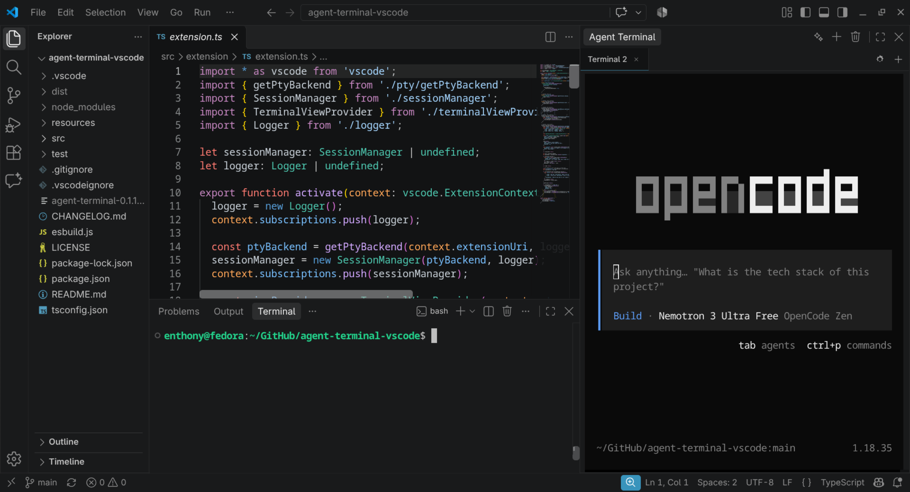

# Agent Terminal for Visual Studio Code

Uma extensão leve e de alto desempenho que adiciona um **terminal dedicado na barra lateral secundária (Secondary Side Bar)**, projetado especificamente para executar agentes de IA via linha de comando (**Claude Code**, **Codex CLI**, **Gemini CLI**, **Antigravity CLI**, etc.) ocupando toda a altura da janela, sem interferir nem mover o terminal nativo do VS Code (aba inferior).

---

## Demonstração do Layout



> **Visualização:** O terminal nativo do VS Code continua embaixo para comandos habituais (build, testes, git), enquanto a barra lateral direita hospeda a TUI do seu agente de IA com altura total.

---

## Requisitos de Sistema

- **VS Code:** Versão `1.106.0` ou superior (versão mínima que suporta a declaração estável de `viewsContainers.secondarySidebar`).
- **Sistemas Suportados:**
  - **Linux e macOS:** Suporte oficial de primeira classe. Inclui aceleração nativa via `node-pty` e redundância com o fallback transparente em Python 3 (`pty_helper.py`).
  - **Windows:** Suporte **não garantido**. O módulo nativo inclui suporte experimental a ConPTY, porém o fallback em Python não funciona em ambientes Windows devido à inexistência do módulo POSIX `pty` na biblioteca padrão do sistema operacional.

---

## Principais Recursos

- **Convivência sem conflitos:** O terminal inferior padrão do VS Code continua funcionando normalmente. O Agent Terminal fica na barra lateral direita.
- **Shell 100% Interativo:** Abre o shell com a flag `-i` (modo interativo) e respeita seus arquivos de inicialização (`~/.bashrc`, `~/.zshrc`), exibindo o prompt completo com cores, caminho e estilo (ex.: `usuario@host:~/projeto$`).
- **Resolução de CWD & Ambiente:** Inicializa automaticamente na pasta raiz do workspace aberto, respeita `terminal.integrated.defaultProfile`, variáveis de ambiente customizadas e suporte a truecolor (`COLORTERM=truecolor`).
- **Renderização Rápida e Leve:** Baseado em **xterm.js v6** com aceleração via **WebGL** (e fallback automático para DOM/canvas). Zero frameworks pesados (HTML/CSS/TS puros).
- **Sem Perda de Histórico:** O terminal utiliza `retainContextWhenHidden: true`, mantendo TUIs em execução (Claude Code, curses, Ink) ativas em segundo plano sem perda de estado e sem "flicker".
- **Múltiplas Abas:** Alterne entre diferentes sessões de agentes, crie novas abas (`+`), feche abas (`x`) e renomeie qualquer aba com **duplo clique**.
- **Seletor de Agentes Integrado:** Menu rápido (QuickPick) para disparar agentes pré-configurados ou comandos personalizados em uma nova aba ou na aba atual.
- **Suporte Avançado a Teclado:**
  - `Ctrl+C`: Se houver seleção, copia o texto. Se não houver seleção, envia `SIGINT` (`^C`) diretamente para cancelar a ação do agente.
  - `Ctrl+Shift+C`: Copia seleção para o clipboard.
  - `Ctrl+Shift+V` ou **Botão Direito**: Cola com *bracketed paste mode* ativo (essencial para colar grandes prompts sem disparar execuções acidentais).
  - Links de terminal clicáveis abrindo no navegador padrão.
- **Backend PTY Resiliente e Sem Compilação:** Utiliza `@homebridge/node-pty-prebuilt-multiarch` (N-API, estável entre versões de Node e Electron do VS Code) com fallback transparente para um helper em **Python 3** padrão no Linux/macOS.

---

## Instalação

### Via Linha de Comando (.vsix)
```bash
code --install-extension agent-terminal-0.1.2.vsix
```

### Pela Interface do VS Code
1. Abra a aba de **Extensões** (`Ctrl+Shift+X`).
2. Clique no menu de três pontos (`...`) no canto superior da lista de extensões.
3. Selecione **Install from VSIX...** e escolha o arquivo `agent-terminal-0.1.2.vsix`.

---

## Como Posicionar na Barra Lateral Secundária

No VS Code moderno (1.106+), o **Agent Terminal** já nasce automaticamente na **Secondary Side Bar** à direita.

Caso queira reposicionar:
1. Pressione `Ctrl+Alt+B` (ou clique no ícone no canto superior direito do VS Code) para exibir a **Secondary Side Bar**.
2. Clique no ícone do **Agent Terminal** e arraste-o para a barra lateral que preferir. O VS Code memoriza essa posição permanentemente.

---

## Atalhos de Teclado Padrão

| Ação | Atalho (Linux/Windows) | Atalho (macOS) |
| :--- | :--- | :--- |
| **Focar no Agent Terminal** | `Ctrl+Alt+T` | `Cmd+Alt+T` |
| **Novo Terminal / Nova Aba** | `Ctrl+Alt+N` | `Cmd+Alt+N` |
| **Lançar Agente de IA** | `Ctrl+Alt+A` | `Cmd+Alt+A` |
| **Encerrar Terminal / Fechar Aba** | `Ctrl+Alt+W` | `Cmd+Alt+W` |
| **Interromper Processo (SIGINT)** | `Ctrl+C` *(sem seleção)* | `Ctrl+C` *(sem seleção)* |
| **Copiar Texto** | `Ctrl+Shift+C` *(ou Ctrl+C com seleção)* | `Cmd+C` |
| **Colar Texto** | `Ctrl+Shift+V` *(ou Botão Direito)* | `Cmd+V` |

---

## Configuração

Você pode personalizar os agentes e opções no seu `settings.json`:

```json
{
  // Lista de agentes de IA disponíveis no QuickPick (Ctrl+Alt+A)
  "agentTerminal.agents": [
    { "name": "Claude Code", "command": "claude" },
    { "name": "Codex CLI", "command": "codex" },
    { "name": "Gemini CLI", "command": "gemini" },
    { "name": "Antigravity", "command": "agy" }
  ],

  // Copiar automaticamente o texto selecionado
  "agentTerminal.copyOnSelect": false,

  // Backend de pseudoterminal: "auto" (recomendado), "node-pty", ou "python"
  "agentTerminal.ptyBackend": "auto"
}
```

O Agent Terminal também herda automaticamente suas preferências de terminal do VS Code:
- `terminal.integrated.fontFamily` (com fallback para `editor.fontFamily` e `, monospace`)
- `terminal.integrated.fontSize`
- `terminal.integrated.lineHeight`
- `terminal.integrated.letterSpacing`
- `terminal.integrated.fontWeight` e `fontWeightBold`
- `terminal.integrated.cursorStyle` e `cursorBlink`
- `terminal.integrated.scrollback`
- Cores do tema ativo do editor (`--vscode-terminal-*`)

---

## Gerenciamento de Backends e Diagnóstico

### Backends Disponíveis
A extensão oferece dois mecanismos de pseudoterminal para conciliar máxima performance e compatibilidade:
1. **`node-pty` (Nativo):** Utiliza `@homebridge/node-pty-prebuilt-multiarch` baseado em N-API. Executa no mesmo processo do Extension Host, com latência zero e uso mínimo de memória.
2. **`python-pty` (Fallback):** Utiliza um script auxiliar em Python 3 (`resources/pty_helper.py`) apoiado na biblioteca padrão (`pty.openpty()`, `termios`, `fcntl` com `TIOCSWINSZ`). Não requer compilação e independe de qualquer versão de ABI do Electron.

### Como Forçar um Backend
No arquivo `settings.json` do VS Code:
- **`"agentTerminal.ptyBackend": "auto"` (Padrão):** No Linux/macOS, tenta carregar o `node-pty`. Se o `require()` falhar (por exemplo, após uma atualização do VS Code mudar o Electron) ou se a chamada de `spawn()` lançar exceção, a extensão ativa automaticamente o `python-pty`.
- **`"agentTerminal.ptyBackend": "node-pty"`:** Força exclusivamente o backend nativo. Se falhar, lança erro no log.
- **`"agentTerminal.ptyBackend": "python"`:** Força exclusivamente o helper Python 3, sem carregar módulos nativos C++.

### Como Diagnosticar (Output Channel)
Para verificar qual backend está em uso ou checar eventuais erros:
1. Pressione `Ctrl+Shift+P` (ou `Cmd+Shift+P` no macOS) e execute o comando:
   **`Agent Terminal: Show Output Log`**
2. Ou abra a aba **Output** no painel inferior do VS Code e selecione **Agent Terminal** no menu suspenso à direita.
3. No painel de log você verá registros como:
   ```text
   [2026-10-06 18:40:00] [INFO] Configuração agentTerminal.ptyBackend: "auto"
   [2026-10-06 18:40:00] [INFO] Backend selecionado: node-pty (@homebridge/node-pty-prebuilt-multiarch)
   [2026-10-06 18:40:01] [INFO] Criando sessão: "Terminal 1" (cwd: /home/usuario/projeto, shell: /bin/bash)
   [2026-10-06 18:40:01] [INFO] Shell iniciado via node-pty (PID: 12345, cmd: /bin/bash)
   ```
4. **Notificação de Fallback:** Caso o `node-pty` apresente falha, um aviso é emitido uma única vez por sessão do VS Code com o motivo e um botão **"Abrir log"**, que direciona imediatamente para o canal de saída detalhando o erro original.

---

## Solução de Problemas

### 1. O comando do agente não é encontrado (`command not found`)
Certifique-se de que a CLI do agente está instalada e disponível no seu `$PATH`. Se você instalou a ferramenta globalmente via npm, pip ou cargo em um diretório de usuário (ex.: `~/.local/bin` ou `~/.cargo/bin`), especifique o comando com caminho completo ou garanta que ele seja exportado no seu `~/.bashrc` / `~/.zshrc`.

### 2. O prompt do shell parece desconfigurado
O Agent Terminal adiciona automaticamente a flag `-i` para forçar o bash/zsh a carregar scripts como Starship, Oh-My-Bash ou powerline. Caso tenha configurações condicionais no seu arquivo de inicialização, verifique se elas dependem da variável `TERM=xterm-256color`.

### 3. Falha ou Incompatibilidade no Módulo Nativo
Se após atualizar o VS Code o terminal emitir a notificação de fallback, o backend Python assumirá o controle de forma transparente. Para investigar, abra o Output Channel via comando `Agent Terminal: Show Output Log` para inspecionar a causa raiz.

---

## Desenvolvimento e Testes

```bash
# Instalar dependências
npm install

# Compilar extensão e webview
npm run compile

# Executar testes unitários do PTY (Node e Python)
npm test

# Modo de desenvolvimento contínuo (watch)
npm run watch

# Empacotar pacote .vsix para distribuição
npm run package
```

---

## Licença

MIT License - Copyright (c) 2026 Enthony Araujo.
